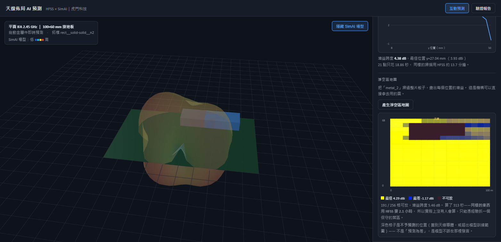
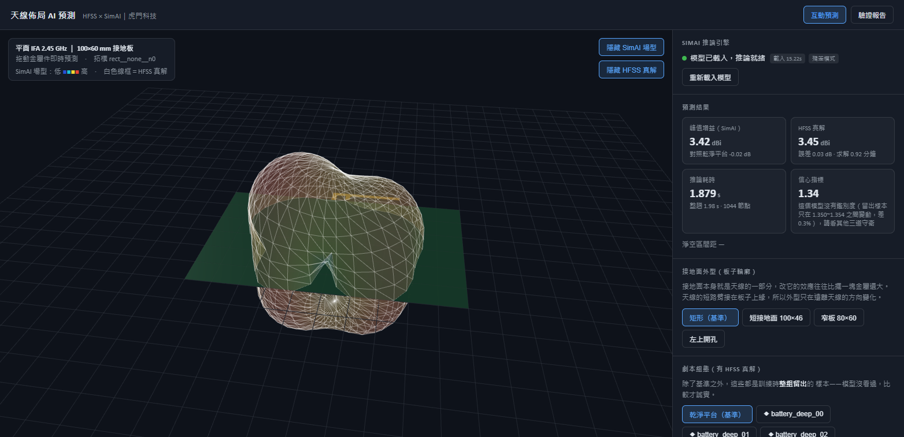

# Antenna Layout AI Prediction (HFSS × SimAI)

English｜[繁體中文](README.zh-TW.md)

Provided by Jeff Hong 洪敬傑, CAE Senior Technical Engineer, Taiwan Auto-Design Co. (TADC).

---

## The problem

A mechanical engineer asks the antenna engineer: **"Can I put the battery here?"**

Today that means editing the model, running HFSS, waiting half a minute to several
minutes, and reporting back. So the question gets asked a handful of times a day, and
most placement decisions are **educated guesses**.

This tool answers the same question in **0.2 s** — which lets you ask a better one:
**"Where *can* this part go?"** — and draw the answer directly.



That is a keep-out map: 16×16 = 256 positions computed in **313 seconds** — 191 of them
usable, with a 5.46 dB gain spread. The same sweep in HFSS takes **2.1 hours**, which is
why nobody runs it in practice.

---

## Features

| Feature | Notes |
| --- | --- |
| **Interactive prediction** | Drag metal parts in the 3D view; releases trigger a re-predict |
| **Side-by-side HFSS ground truth** | White wireframe is the true solution, drawn with the **same radius mapping** (normalising each separately would fake the resemblance) |
| **Position sensitivity sweep** | 21 points along one axis in ~19 s; HFSS needs ~14 minutes |
| **Keep-out map** | 2D grid sweep showing where a part may go — directly usable by mechanical engineering |
| **Validation report** | Leave-one-topology-out, per-sample comparison, pattern cuts, skill score |
| **Swap the antenna** | Antenna geometry is config-driven — a different antenna is a config change, not a code change |
| **Feasibility screening** | 15 minutes to decide whether an antenna is worth modelling at all, instead of committing 2–3 hours first |
| **Model bundling** | Pack the trained model into a zip so a colleague can run it without retraining |



---

## Four independent honesty guards

The model will produce **confidently wrong answers**, and the four failure modes are
blind to each other. Each guard was added only after measurement proved it necessary:

| Guard | Catches | Why the others miss it |
| --- | --- | --- |
| ① Skill score | "Passes thresholds" but learned nothing | Error thresholds pass on their own — a dumb baseline at 1.16 dB MAE clears the 1.5 dB gate |
| ② Domain guard (checks **input**) | Input outside the training range | The GP confidence misses it: an unseen ground outline scored **0.00 (all green)** |
| ③ GP confidence interval | How hard this pattern is to predict | Only meaningful when the input is sane |
| ④ Physical plausibility (checks **output**) | Impossible output values | See below |

**Why ④ is not optional.** Measured: a configuration whose true peak gain was 1.95 dBi
was predicted at **12.74 dBi** — impossible for a small PIFA. In the same validation run:

| Sample | Peak error | Confidence width |
| --- | --- | --- |
| notch_battery_deep_00 | **10.79 dB** | 0.395 |
| shortgnd_battery_deep_01 | 0.08 dB | 0.396 |

The **confidence indicator is identical to three decimal places**. The domain guard stays
silent too, because every input parameter is inside the trained range — it is the
**output** that is absurd. Pattern MAE hides it as well (only 1.20 dB): a handful of
blown-up nodes get diluted by averaging.

> **General rule: averaged metrics (MAE) dilute catastrophic errors at a few nodes.
> Always read an extremal metric (peak error, max error) alongside them.**

---

## Current validation

| | Built-in PIFA | Customer case (synthetic) |
| --- | --- | --- |
| HFSS samples | 160 | 115 |
| Peak gain error | 1.16 dB | **0.61 dB** |
| Pattern MAE | 1.40 dB | **0.88 dB** |
| Skill score | 0.566 | 0.261 |
| Inference vs HFSS | ~120–200× | ~120–200× |

The held-out group is the most extreme `battery_deep` topology, entirely unseen by the
model. **Report numbers must always be read together with which group was held out**:
holding out `battery_near` instead gives a 0.26 dB peak error on the same dataset.

### Known limitations (stated, not hidden)

- **Peak gain is an unstable metric.** Retraining the identical configuration once:
  pattern MAE 1.39 → 1.40 dB and skill 0.569 → 0.566 (essentially unchanged), but overall
  peak error 2.98 → 1.16 dB and one ground shape's peak 8.52 → 0.88 dB. Peak is a max over
  684 nodes, so a single blown-up node dominates it. **Any conclusion based on peak needs
  at least two independent training runs** — we published "this ground shape is unusable"
  as a known limitation and it turned out to be single-run noise (see the correction in
  [ADR-0005](docs/adr/0005-notch-peak-failure-unresolved.md)).
- Trained at **2.45 GHz only**; one model corresponds to one antenna.
- Absolute values in deep nulls are less accurate.
- **This repository does not contain a trained model** (~85 MB, above GitHub's per-file
  limit). Download one from [Releases](../../releases/latest) (not yet uploaded
  here), or run the training pipeline yourself.

---

## Prerequisites

| Item | Purpose | Notes |
| --- | --- | --- |
| **Ansys SimAI Pro 26.1.0** | Inference engine | Required. The tool runs its inference worker with SimAI's own `.venv` python |
| **Ansys HFSS (AEDT 2026 R1)** | Generating training data | Only needed to rebuild the dataset |
| **Python 3.12 (64-bit)** | Backend | The launcher creates the virtual environment on first run |
| Node.js 20+ | **Development only** | Not needed to run — `frontend/dist` ships with the repository |

**Licensing**: `load_model()` and `predict()` **do not require a license**; only training
(`fit`) does. Interactive use therefore does not need SimAI Pro running — only retraining does.

The backend installs three packages (`fastapi`, `uvicorn[standard]`, `pydantic`).
**torch, stochos and pyvista are not installed** — they exist only inside SimAI Pro's own
environment.

---

## Quick start (Windows)

Double-click:

```
web_app\start.bat
```

First launch builds the Python environment (about a minute); later launches take ~15 s to
load the model. The browser opens automatically. If the port is taken, the launcher shifts
to the next free one and prints which port it landed on.

- If it detects this same tool already running, it **reuses the existing backend**
  instead of starting a second copy
- If you pass `-Port` explicitly and that port is busy, it fails loudly rather than
  silently moving
- `Ctrl+C` or closing the window stops the service (and confirms the port was released)

**All processing is local.** The only network access is installing Python packages on
first run.

Detailed guide (Traditional Chinese): **[docs/操作說明.md](docs/操作說明.md)**.

---

## Using your own antenna

Antenna geometry is described by a config file, so a different antenna is a config change:

```bat
set PLATFORM_CONFIG=customer_iot_monopole
```

Each platform's data, model and validation results are fully isolated. The example
platform `platforms/customer_iot_monopole.json` (60×40 mm board, five-segment meandered
monopole) is a **synthetic demonstration case, not real customer data**.

---

## Screen first (15 minutes)

The full pipeline takes 2–3 hours before you know whether it worked. Run this first:

```bash
python pipeline/screen_platform.py 2 0
```

It measures the **learnable signal** — how much a perturbation changes the pattern, which
is the denominator of the skill score. A signal below 1.0 dB means **this antenna is not
sensitive to these parts**, and that is itself the answer for the customer — far better
than spending three hours to produce a low-scoring model and then explaining it. The
thresholds are back-derived from two completed platforms, not guessed.

---

## Handing the model to someone else

The trained model is ~85 MB and **not in the repository** (above GitHub's per-file limit).
Both platforms' models are published in **[Releases](../../releases/latest)** (not yet
uploaded here — ask, or run the training pipeline yourself):

```bash
gh release download v0.1.0 --pattern "model_platform.zip"
sha256sum -c SHA256SUMS.txt
python pipeline/model_bundle.py unpack model_platform.zip
web_app\start.bat
```

To pack your own (e.g. after retraining):

```bash
python pipeline/model_bundle.py pack
```

Restoring rewrites the model path — otherwise it points at the packing machine's
`APPDATA` and the worker only reports "no trained model configured", never that the path
came from someone else's computer. A platform mismatch is refused outright.

---

## Technology

Ansys SimAI Pro (Stochos GNN), Ansys HFSS, PyAEDT, FastAPI,
React + TypeScript + Vite, Three.js, PyVista.

Design decisions are recorded in [docs/adr/](docs/adr/): the generalization axis, the
prediction target, engine selection, residual learning with VTP node features, and one
**unresolved** defect.

---

## Contact and ownership

Professional simulation services and technical engagements are conducted through
**Taiwan Auto-Design Co. (TADC)** using company-provided Ansys resources and licenses.

- Jeff Hong 洪敬傑｜CAE Senior Technical Engineer
- Taiwan Auto-Design Co. (TADC) <https://www.cadmen.com/>
- jeff.hong@cadmen.com

> This repository is for **technical demonstration purposes**. It is not an official
> product of Taiwan Auto-Design Co. (TADC), and it is not officially affiliated with
> Ansys, Inc. Ansys is a trademark of Ansys, Inc.
>
> **All rights reserved; no open-source licence, deliberately.** The work was produced
> in a professional context, so copyright ownership and commercial licensing terms have
> to be settled first. You may read it and run it to evaluate the approach; for anything
> else, get in touch. Full terms in [NOTICE.md](NOTICE.md).
