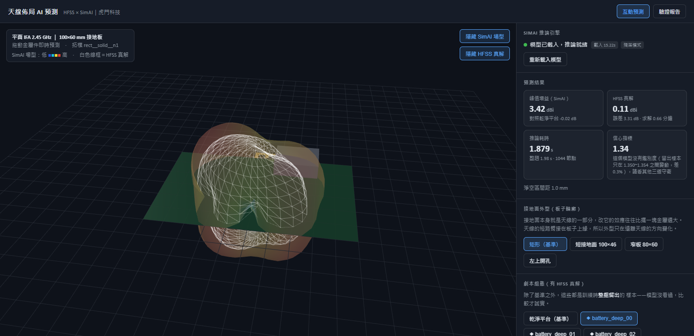
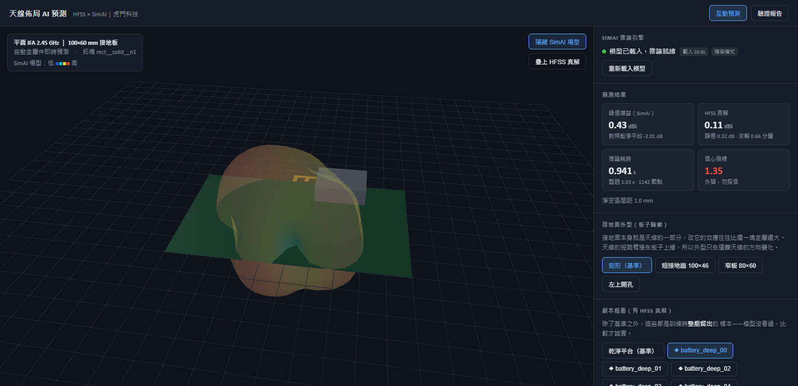
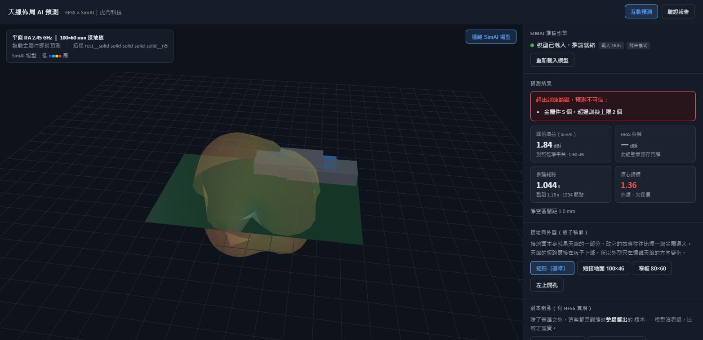
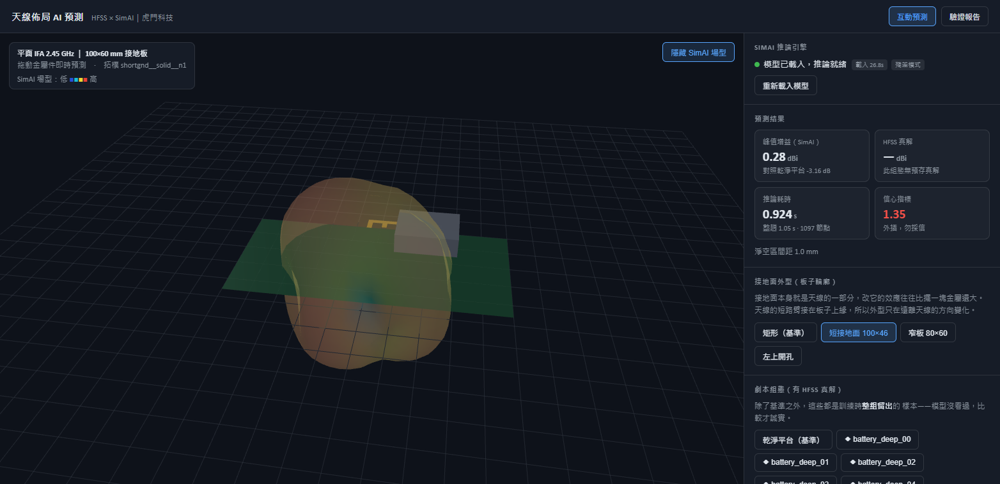
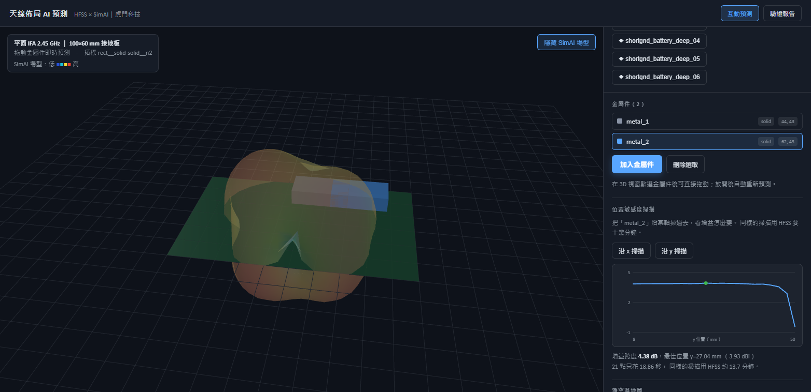
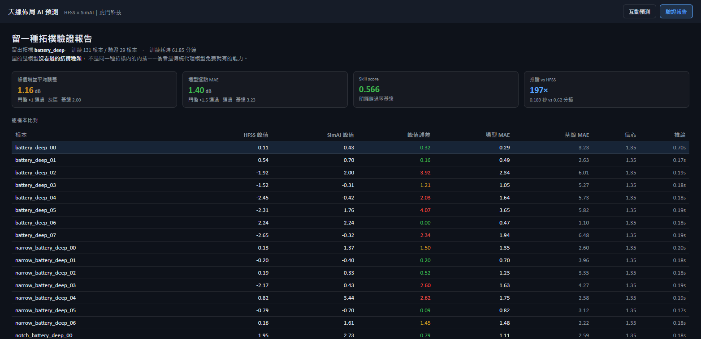
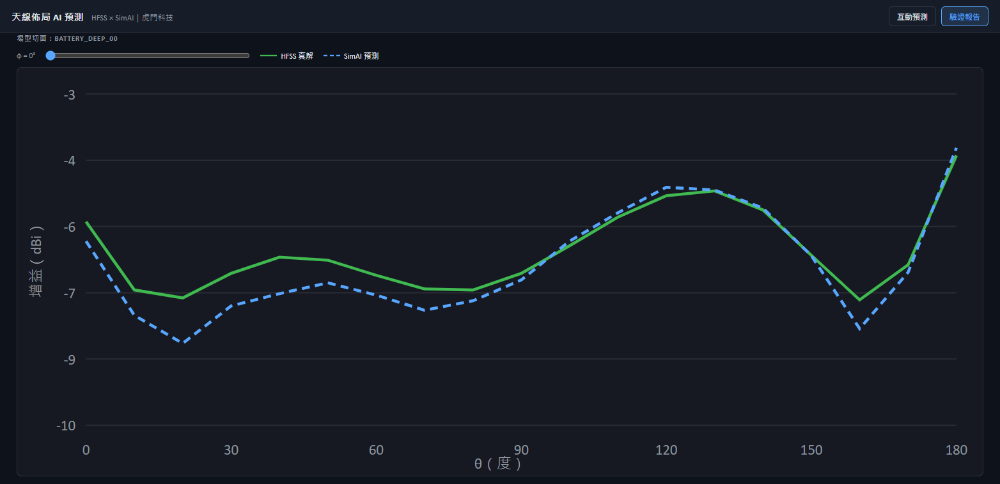
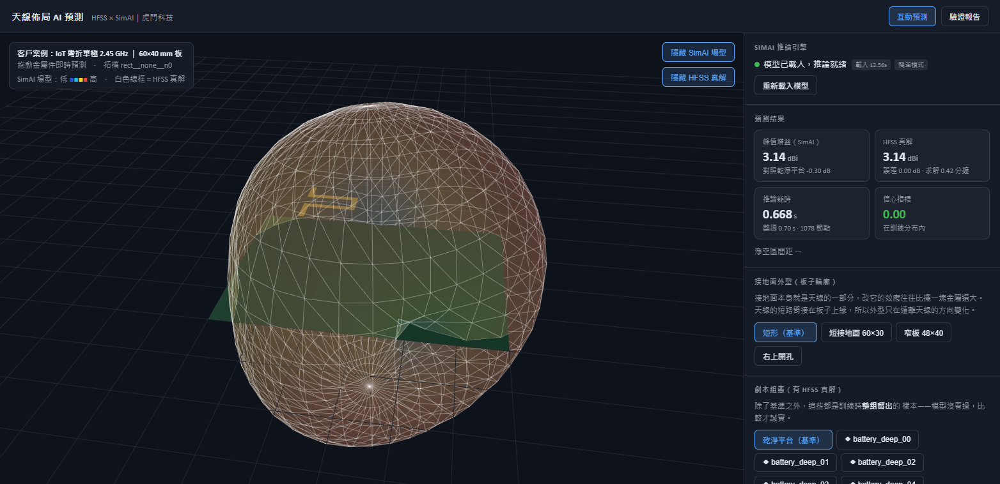

# 天線佈局 AI 預測工具　操作說明

此工具由虎門科技資深技術工程師Jeff Hong洪敬傑提供。

本文件的截圖全部取自同一次真實操作（2026-08-29），使用目前出貨的
160 樣本模型，沒有擺拍或後製。截圖上的數字與內文一致。

---

## 一、這個工具在做什麼

同一支 2.45 GHz 平面 IFA 天線，周圍換不同的金屬環境（電池、支架、螢幕框），
**SimAI 在 0.2 秒內預測出遠場輻射場型**，而同一個組態用 HFSS 求解要 0.6 分鐘。

決定天線好壞的那些東西——接地面形狀、附近有什麼金屬、淨空區被誰吃掉——
恰好是參數化方法寫不出來的部分。這正是 SimAI 相對傳統代理模型的價值。

---

## 二、需要先準備什麼

| 項目 | 用途 | 備註 |
| --- | --- | --- |
| **Ansys SimAI Pro 26.1.0** | 推論引擎 | 必須安裝。工具會用它自己的 `.venv` python 執行推論 worker |
| **Python 3.10 以上** | 後端 | 建議 3.12。首次啟動會自動建立虛擬環境 |
| Node.js 20 以上 | **只有開發時需要** | 一般使用不需要 |

後端只會安裝三個套件（`fastapi`、`uvicorn[standard]`、`pydantic`）。
**torch、stochos、pyvista 不會被安裝**——它們只存在於 SimAI Pro 自己的環境，
由推論 worker 在那個環境裡使用。

> **不需要啟動 SimAI Pro。** 推論不需要授權，模型檔直接從磁碟載入。
> 只有重新訓練模型時才需要開 SimAI Pro。

---

## 三、啟動

雙擊：

```
web_app\start.bat
```

首次啟動會建立 Python 環境（約一分鐘）。瀏覽器會自動開啟 <http://127.0.0.1:8012>，
模型在背景載入，右側「SimAI 推論引擎」顯示「模型載入中…已 N 秒」，就緒後自動跑第一次預測。

| 情況 | 載入時間 | 處理 |
|---|---|---|
| 平常 | 約 26～37 秒 | 等它變綠燈 |
| 新電腦第一次 | 可能數分鐘（防毒掃描） | 等；超過 900 秒會停下並顯示原因 |
| 顯示「載入超過 N 秒」 | — | 以 `start.bat -ModelLoadTimeoutSec 1800` 重開，或設環境變數 `SIMAI_LOAD_TIMEOUT` 後按「重新載入模型」 |
| 其他失敗 | — | 原因顯示在畫面上；完整錯誤輸出在 `web_app\backend\runs\worker_stderr.log` |

連接埠被佔用時會自動往後找一個可用的；按 `Ctrl+C` 結束服務。

---

## 四、互動預測

### 4.1 起點：乾淨平台

左側選「乾淨平台（基準）」，這是沒有任何金屬件的參考組態。


畫面上的東西：

- **綠色平面**＝接地板（100 × 60 mm），**黃色細條**＝平面 IFA 天線（固定不變）
- **彩色曲面**＝SimAI 預測的遠場輻射場型，顏色由藍到紅代表增益由低到高
- **白色線框**＝HFSS 真解的場型（只有劇本組態才有）

右側四張卡片：

| 卡片 | 意義 |
| --- | --- |
| 峰值增益（SimAI） | 模型預測的最大增益，以及與乾淨平台相比差了幾 dB |
| HFSS 真解 | 預存的真解與誤差（沒有真解的組態顯示「—」） |
| 推論耗時 | 模型本身的計算時間，以及含網格產生的整趟時間 |
| 信心指標 | 相對**這個模型自己**平常的表現，這次算得吃力嗎。**見 4.4——它在某些模型上完全沒有鑑別度** |

乾淨平台上 SimAI 給 3.45 dBi、HFSS 真解也是 3.45 dBi，**誤差 0.00 dB**——
因為模型學的是「與乾淨平台的差」，在基準上殘差本來就是零。
**如果這裡不是 0.00，就有東西壞了。**

### 4.2 留出樣本：與 HFSS 真解並排

左側標有 **◆** 的組態是訓練時**整組留出**的樣本——模型完全沒看過。
點 `battery_deep_00`：



電池深入淨空區（間距只剩 1.0 mm），增益從 3.45 dBi 掉到 0.43 dBi。
HFSS 真解是 0.11 dBi，**誤差 0.32 dB**。白色線框（HFSS）與彩色曲面
（SimAI）幾乎重合。

> 兩個場型用**同一個半徑對應關係**繪製。如果各自正規化，形狀看起來會很像，
> 但那是假的相似——比對就沒有意義了。

**這一張的信心指標顯示灰色的「這個模型沒有鑑別度」。** 因為這個模型的
信心值在全部 29 個留出樣本上只落在 1.350~1.354，而那些樣本的實際誤差
差了 12.7 倍——它是個常數，看它沒有意義（見 4.4）。
**所以要靠另外三道守衛。**

推論耗時 0.94 秒（機器同時有其他負載時會慢），而同一個組態 HFSS 求解
要 0.66 分鐘。

### 4.3 自己拖動金屬件

按右上角「隱藏 HFSS 真解」關掉白色線框，幾何就看得清楚了：



綠色是接地板、黃色細條是天線、**灰色方塊是電池**——它伸出接地板上緣、
進到了淨空區，這就是增益從 3.45 掉到 0.42 dBi 的原因。

在 3D 視窗**點選金屬件**（會變成藍色），然後直接拖動。放開後自動重新預測。

- 右上角「隱藏 SimAI 場型」可以把場型也關掉，更方便抓取金屬件
- 「加入金屬件／刪除選取」可以改變拓樸（金屬件的數量）
- 左側面板會顯示**淨空區間距**——金屬件離天線多近

金屬件待在接地板上（y < 60 mm）時幾乎不影響增益，因為那本來就是導體表面。
**真正的效應發生在金屬件伸出板緣、進到淨空區的時候。**

### 4.4 什麼時候不要相信預測

工具有**四道**互相獨立的防線，四道都要看。它們攔的是不同種類的錯，
而且**會互相漏接**——每一道都是被實測打臉之後才加的。

**第一道：定義域警告（紅框，顯示在數字上方）**



逐項列出這個組態哪裡超出訓練資料的實際涵蓋範圍——金屬件數量、尺寸、
離板高度、接地面形狀、頻率。看到這個紅框，**下方的數字就不要採用**。

**第二道：信心指標（★ 門檻是按模型校準的，不是固定值）**

| 顯示 | 意思 |
| --- | --- |
| 綠色「比這個模型平常算的還穩」 | 落在該模型留出分布的前 60% |
| 黃色「比平常難算一些」 | 60% ~ 90% |
| 紅色「這個模型算過最難的一類」 | 超過 90%，建議跑 HFSS 確認 |
| **灰色「這個模型沒有鑑別度」** | **這個模型的信心值幾乎不變，看它沒有意義** |

> **為什麼不能用固定門檻。** 信心值的**絕對尺度隨模型而變**：實測同一支
> 天線的不同訓練，留出樣本的中位數從 0.55 到 4.4 都有。用寫死的
> 「<0.5 綠 / >1.2 紅」，有的模型會永遠綠、有的永遠紅——**兩種都等於沒有資訊**。
> 所以現在用**該模型自己的留出分布**當基準，問的是「相對它平常的表現，
> 這次算得比較吃力嗎」。

> **更常見的是它根本不會動。** 目前出貨的 PIFA 模型，29 個留出樣本的
> 信心值落在 **1.350~1.354（變動只有 0.3%）**，而同一批樣本的場型 MAE
> 差了 **12.7 倍**（0.29 ~ 3.65 dB），兩者的相關係數只有 **0.216**。
> 換句話說**它是個常數**，排序都排不出來。
> 這種情況介面會直接顯示灰色的「沒有鑑別度」，**而不是每次都亮紅燈**——
> 天天喊狼來了，只會讓人學會忽略它。

**這代表你應該主要依賴另外三道守衛。** 信心指標在某些模型上有鑑別度
（實測客戶天線那個模型變動 44%），在某些上完全沒有，介面會告訴你是哪一種。

**第三道：輸出的物理合理性（2026-08-29 新增）**

前兩道檢查的都是**輸入**。但輸入完全正常、**輸出卻離譜**的情況真的會發生，
而且前兩道都攔不住：

實測（留出 `battery_deep` 的模型）：`notch_battery_deep_00` 這個組態，
峰值增益真值 1.95 dBi，模型預測 **12.74 dBi**——小型 PIFA 不可能有那種增益。
同一次驗證裡：

| 樣本 | 峰值誤差 | 信心指標 |
| --- | --- | --- |
| `notch_battery_deep_00` | **10.79 dB** | 0.395（綠） |
| `shortgnd_battery_deep_01` | 0.08 dB | 0.396（綠） |

**信心指標到小數第三位幾乎一樣**，完全分不出這兩個。定義域警告也不會亮，
因為那個組態的每個參數都在訓練範圍內。連場型 MAE 都看不出來
（只有 1.20 dB）——因為只有少數幾個節點爆掉，一平均就被稀釋了。

現在只要預測值超出訓練資料看過的增益範圍，就會出現警告直接說
「這個數字物理上不太可能，請不要採信」。

> **這件事的通則**：平均型的指標（MAE）會稀釋掉少數節點的災難性錯誤。
> 看報告時一定要同時看**極值型**的指標（峰值誤差、最大誤差）。

**第四道：不合物理的組態。** 把金屬件拖到蓋住天線導體時，
畫面下方會跳出紅色警告——那個組態等於把天線短路，
訓練資料裡刻意排除了這種幾何（產生資料時就被品質閘攔下）。

### 4.5 換板子輪廓

右側「接地面外型」可以切換板子輪廓：



| 外型 | 說明 |
| --- | --- |
| 矩形（基準） | 100 × 60 mm |
| 短接地面 100×46 | 接地面長度縮短——接地面長度是天線效能的主導因素 |
| 窄板 80×60 | 板子變窄 |
| 左上開孔 | 左上角挖一塊（相機／喇叭開孔） |

**接地面本身就是天線的一部分**（它是輻射體），改它的效應往往比擺一塊金屬還大。
這也是客戶最常問的問題：「板子外型改了，天線還行嗎？」

> 天線的短路臂接在板子上緣（y = 60），所以所有外型的上緣都維持不變——
> 從天線那一側縮板會讓天線直接斷路。變異只發生在遠離天線的方向。

### 4.6 位置敏感度掃描

選取一個金屬件後，下方會出現「位置敏感度掃描」。按「沿 y 掃描」：



上圖的結果：金屬件在 y < 45 mm 時增益穩定在 3.9 dBi，**再往上就直墜到
−0.45 dBi**，跨度 **4.38 dB**。給機構的建議就是一句話：**保持在 y = 45 以下**。

21 個點只花 18.9 秒；同樣的掃描用 HFSS 要約 13.7 分鐘。

> **掃出平線不代表「位置不重要」，通常代表金屬件從頭到尾都離天線太遠。**
> 同一支天線換一個擺放位置，跨度可以從 0.3 dB 變成 4.38 dB。
> 2.45 GHz 的近場耦合大致發生在 λ/10 ≈ 12 mm 以內，
> 掃描前先確認金屬件真的會進到那個範圍。

**這才是「快」真正的價值。** 重點不是「同樣的答案更快拿到」，而是
**這個問題原本不值得問**——沒有人會為了確認一個位置容差去跑 14 分鐘的掃描，
所以實務上大家只能猜。0.2 秒的推論把它從「不值得問」變成「隨手就問」。

曲線上的**紅點**代表該位置蓋到天線或超出訓練範圍，不可採用。

### 4.7 淨空區地圖

選取金屬件後，下方「產生淨空區地圖」會把它掃過整片板子：


**這是這個工具唯一「機構工程師可以直接拿去用」的輸出**——不必懂天線，
看顏色就知道零件能放哪裡。

| 顏色 | 意思 |
| --- | --- |
| 黃（亮） | 增益最好的位置 |
| 藍（暗） | 增益最差但仍可放 |
| **深紅** | **不可放**——蓋到天線導體，或超出模型的訓練範圍 |
| 黃色虛線框 | 天線的位置（沒有它，看圖的人不知道禁區為什麼在那裡） |

> **深紅不是「預測為差」，是「不予預測」。** 那些位置模型沒學過，
> 給一個數字比不給更糟——那會是臆測，而且看起來跟真的一樣。

實測（內建 PIFA、16×16 網格）：**313 秒**算完 256 個位置，其中 191 格可放、
增益跨度 **5.46 dB**；同樣的東西用 HFSS 要 **2.1 小時**。

**這才是推論便宜真正改變的事**：從「驗證一個猜測」變成「直接把答案畫出來」。
沒有這張圖，機構只能憑經驗抓一個保守的禁區——保守到犧牲了本來可用的空間，
或不夠保守而在 EVT 才發現天線爛掉。

> 網格越密越久（20×20 約 4 分鐘、30×30 約 9 分鐘）。
> 推論速度也受機器負載影響：機器閒置時單次約 0.2 秒，
> 有其他求解器在跑時會掉到 0.6 秒左右。

---

## 五、驗證報告

上方切到「驗證報告」分頁。



### 5.1 怎麼讀這份報告

報告量的是**留一種拓樸驗證**：訓練時把 `battery_deep` 這一整種拓樸留出去，
模型完全沒看過，再拿它來測。

> 為什麼不用隨機切分？隨機切 10% 當測試集會給出一個很漂亮但毫無意義的誤差——
> 它量的是同一種拓樸內的內插，那是傳統代理模型免費就有的能力。

四張卡片（下表為留出 `battery_deep`、131 訓練／29 驗證的結果）：

| 指標 | 結果 | 門檻 | 判定 |
| --- | --- | --- | --- |
| 峰值增益平均誤差 | 1.16 dB | < 1.0 通過、< 2.0 灰區 | 灰區 |
| 場型逐點 MAE | 1.40 dB | < 1.5 通過 | 通過 |
| Skill score | 0.566 | — | 明顯勝過笨基線（3.23） |
| 推論 vs HFSS | 197 倍 | — | 0.189 秒 vs 0.62 分鐘 |

**Skill score 是最該看的一格。** 這支天線的場型本來就長得差不多，
所以一個「永遠輸出訓練集平均場型」的笨模型也能通過 MAE 門檻。
Skill score 量的是「模型比什麼都不學好多少」：0 代表跟笨基線一樣，
1 代表完美。低於 0.15 時介面會跳出誠實性警告。

> **留出的拓樸換掉，結論會變。** 留出比較溫和的 `battery_near` 時，
> 同一份資料集的峰值誤差是 0.26 dB。上表刻意選最難的 `battery_deep`。
> 報告上的數字永遠要連著「留出的是哪一組」一起看。

**skill score 低有兩種完全相反的原因**，報告會分給你看：

| 情況 | 意思 | 該怎麼辦 |
| --- | --- | --- |
| 可學訊號大、skill 低 | 模型沒學好 | 加樣本、改模型 |
| 可學訊號小、skill 低 | **這個平台對這些擾動本來就不敏感** | 「金屬件怎麼擺影響都不大」本身就是結論 |

「可學訊號」＝留出樣本離訓練集平均場型有多遠，也就是 skill 的分母。
`validation.json` 裡的 `learnable_signal_db` 與 `low_skill_reason` 就是這兩欄。

### 5.2 逐樣本比對

表格每一列是一個留出樣本，點擊可切換下方的場型切面圖。
綠色欄位是通過門檻的誤差、黃色是灰區。

### 5.3 場型切面



固定一個 φ 角、看增益隨 θ 的變化。綠色實線是 HFSS 真解、藍色虛線是 SimAI 預測。
拖動上方滑桿可以看不同的 φ 切面。

上圖是 `battery_deep_00` 的 φ = 0° 切面。這一刀切在**深零點區域**
（增益 −4 ~ −9 dBi，遠低於 0.11 dBi 的峰值），兩條線的形狀吻合，
但 SimAI 在 θ = 0~80° 之間系統性地低估約 0.5 dB。

這是正常的：模型抓得住場型的形狀與峰值（這個樣本的峰值誤差只有 0.32 dB），
但深零點的絕對值較不準。實務上零點的位置比它的深度重要，
所以這個偏差對設計決策影響不大——但**看報告時要多切幾個 φ**，
不要只看一刀就下結論。

---

## 六、重新產生資料集與模型

只有要換天線、換頻率或擴大資料集時才需要。四個步驟，每一步都可以單獨重跑
（會自動跳過已完成的部分）：

```bash
python pipeline/solve_dataset.py 8 0
```

HFSS 求解，約 25 分鐘／50 個樣本。第二個參數 `0` 代表**自己開專屬的
AEDT session**——長時間批次不要借用外部 session，那個 session 消失時
腳本會卡在一個永遠不會回來的呼叫上。

```bash
"<SimAI>\...\python.exe" pipeline/build_dataset.py
python pipeline/train_model.py http://127.0.0.1:<API埠> battery_near
"<SimAI>\...\python.exe" pipeline/validate_model.py
```

`train_model.py` 需要 SimAI Pro 開著（API 埠抄 `orchestrator.log`），
訓練 65 個樣本約 90 分鐘。`validate_model.py` 跑完會寫出：

- `runs/validation.json`——驗證報告的資料
- `runs/scenarios.json`——劇本組態（留出樣本＋真解場型）
- `runs/active_model.json`——讓工具自動找到模型，不必手動設定路徑

---

## 七、模型現況與已知限制

**資料集**：160 個 HFSS 真解，10 種拓樸 × 4 種接地面外型，
每個樣本 1142 節點（其中 684 個是遠場球）。

> **報告上的數字必須連著「留出的是哪一組」一起看。** 留出 `battery_near`
> 時峰值誤差 0.26 dB；留出最極端的 `battery_deep` 時是 1.16 dB。
> 目前出貨的模型留出的是 `battery_deep`——這是**刻意選最難的**，
> 但也代表這個模型沒學過 `battery_deep` 那一類極深的侵入。

**已知限制**：

- **峰值增益是不穩定的指標，單次結果不要當真。**

  同一個設定重訓一次（160 樣本、留出 `battery_deep`）：

  | | 第一次 | 第二次 |
  | --- | --- | --- |
  | 場型 MAE | 1.39 dB | 1.40 dB |
  | skill score | 0.569 | 0.566 |
  | **整體峰值誤差** | **2.98 dB** | **1.16 dB** |
  | **`notch` 板型峰值** | **8.52 dB** | **0.88 dB** |

  場型 MAE 與 skill 幾乎完全一致，峰值卻差了 7.64 dB。
  峰值是 684 個節點取 max——單一節點爆掉就主導整個數字，
  而場型 MAE 會把它平均掉。

  > **任何基於峰值的結論都需要至少兩次獨立訓練。**
  > 我們自己踩過：先前把「`notch` 板型不可用」寫成已知限制並發佈，
  > 實際上那是單次訓練的雜訊（見 [ADR-0005](adr/0005-notch-peak-failure-unresolved.md) 的更正）。
  > 這也讓第四道守衛（輸出物理合理性）更重要——
  > **任何板型都可能偶發地在某個節點爆掉**，不是只有某一種。

- 只訓練了 **2.45 GHz 單頻**。換頻率要重新產生資料集。
- **一個模型只對應一支天線**。泛化軸是「同一支天線換環境」，不是換天線。
  換天線要重新產生資料集與模型——但**不必改程式**，見第十章。
- 金屬件與天線導體重疊的組態不在訓練範圍內（那種幾何不合物理）。
- 深零點的絕對值較不準，見 5.3。
- 推論端沒有授權檢查，這看起來是「訓練授權、部署自由」的正常模式，
  但對外部署前建議先向 Ansys 確認條款。

---

## 八、先花 15 分鐘判斷值不值得做

**完整流程要 2~3 小時**（HFSS 求解 ＋ SimAI 訓練）才知道結果。
先跑篩檢，只解 1 個乾淨樣本 ＋ 幾個**刻意貼著天線**的極端樣本：

```bash
set PLATFORM_CONFIG=customer_iot_monopole
python pipeline/screen_platform.py 2 0
```

它量的是**可學訊號**——擾動讓場型改變了多少。那個數字就是 skill score 的分母：

```
skill = 1 − 模型MAE / 可學訊號
```

模型的絕對誤差有下限（兩個平台實測都在 0.6~0.9 dB），
所以可學訊號太小時 skill 再怎麼調都上不去。

| 可學訊號 | 判定 | 意思 |
| --- | --- | --- |
| **≥ 2.0 dB** | 值得做 | 明顯大於誤差下限，建模後 skill 會有意義 |
| 1.0 ~ 2.0 dB | 灰區 | 做得出來但 skill 偏低（約 0.2~0.4），要先講清楚 |
| **< 1.0 dB** | 不建議 | 與誤差下限同量級，模型不會比笨基線好多少 |

> **門檻不是猜的**，是從兩個已完成的平台反推：
> 內建 PIFA 訊號 3.23 dB → skill 0.569；客戶單極 1.19 dB → skill 0.261。

**「不建議」本身就是給客戶的答案**：這支天線對這些零件不敏感、
擺放位置不必糾結。十五分鐘拿到這個結論，好過花三小時做一個低分模型再解釋。

> 這一步是被實測逼出來的：客戶天線第一版跑完整條流程三小時，
> skill score 只有 0.047——資料集裡 29% 的樣本擾動源遠在近場之外，等於白跑。

---

## 九、把模型交給別人

訓練好的模型**不在版本庫裡**——它是 SimAI 的產物，存在
`%APPDATA%\Ansys\glow\...` 底下，約 85 MB，超過 GitHub 單檔上限。

所以任何人 clone 之後都得先自己跑完整條管線，工具才會動。
用這支腳本可以省掉那 2~3 小時：

```bash
python pipeline/model_bundle.py pack              # 打包成 model_<平台>.zip
python pipeline/model_bundle.py unpack <檔案.zip>  # 在另一台機器還原
```

打包內容：模型檔、殘差基準、定義域快照、驗證報告、劇本組態。

**兩個守衛**（都是實測過的）：

- **還原時會重寫 `model_dir`**。不重寫的話它會指向打包那台機器的 `APPDATA` 路徑，
  而 worker 只會說「尚未設定訓練好的模型」，**不會告訴你路徑來自別人的電腦**。
- **平台不符直接拒絕**。載入另一支天線的模型不會報錯，
  只會給出看似合理的錯答案——所以擋在還原這一步。

實測：還原後的模型直接啟動即可推論，乾淨平台預測 3.136 dBi，
與 HFSS 真解完全相同（誤差 0.000 dB）。

模型本身走 **GitHub Releases** 發佈（版本庫放不下）。

---

## 十、換成客戶自己的天線

天線幾何**不是寫死在程式裡的**，而是由一份平台定義檔描述。
換一支天線是改組態，不是改程式。

### 10.1 平台定義檔

| 檔案 | 內容 |
| --- | --- |
| `platform.json`（專案根目錄） | 預設平台：2.45 GHz 平面 IFA |
| `platforms/customer_iot_monopole.json` | 範例：60×40 mm 板、五段蜿蜒單極 |

用環境變數指定要用哪一個（短名即可，會自動去 `platforms/` 找）：

```bash
set PLATFORM_CONFIG=customer_iot_monopole
```

**每個平台的資料、模型、驗證結果完全隔離**，各自放在
`pipeline/runs/<平台名>/` 底下。這一點很重要：載入到另一支天線的模型，
幾何完全不同卻**不會有任何錯誤**，只會給出看似合理的錯答案。

### 10.2 定義檔要寫什麼

`antenna.traces` 是天線的銅箔矩形；`ground_shapes` 是板子輪廓的變體；
`metal_kinds` 描述金屬件怎麼拆成方塊；`sampling` 是產生資料時的取樣範圍。
照 `customer_iot_monopole.json` 改是最快的作法。

> **`sampling` 是最容易寫錯、也最貴的一塊。** 見 10.5。

### 10.3 換過去之後長什麼樣



同一個介面、同一份程式碼，只換了 `PLATFORM_CONFIG`：
標題變成客戶天線的名稱、板型選項變成 60×40 板的尺寸
（短接地面 60×30、窄板 48×40、右上開孔）、3D 視窗裡是那支蜿蜒單極。
劇本組態也換成客戶天線自己的留出樣本。

### 10.4 完整流程

```bash
set PLATFORM_CONFIG=customer_iot_monopole
python pipeline/solve_dataset.py 7 0
"<SimAI>\...\python.exe" pipeline/build_dataset.py
python pipeline/train_model.py http://127.0.0.1:<API埠> battery_deep
"<SimAI>\...\python.exe" pipeline/validate_model.py
```

實測（2026-08-29，這支蜿蜒單極）：115 個樣本，HFSS 求解 27 分鐘、
SimAI 訓練 30 分鐘。驗證結果峰值誤差 0.55 dB、場型 MAE 0.85 dB、
skill score 0.287、推論快 143 倍。

### 10.5 取樣範圍：這裡犯的錯最貴

**擾動源要放在真正會產生效應的地方，否則樣本白跑。**

實測：這支天線第一版的資料集有 **29% 的樣本**金屬件遠在近場之外
（離銅箔 >12 mm），只造成 0.36 dB 的場型變化——幾乎是乾淨樣本的複製品。
它們既不帶資訊，又把 skill score 的分母拉低。

| 最近金屬距離 | 場型相對乾淨平台的改變 |
| --- | --- |
| < 2 mm | **1.68 dB**（最大 6.06） |
| 2 ~ 5 mm | 1.01 dB |
| 5 ~ 12 mm | 0.94 dB |
| **> 12 mm** | **0.36 dB** |

2.45 GHz 的波長是 122 mm，近場耦合大致發生在 λ/10 ≈ 12 mm 以內。

> **量距離時要用 `metal_boxes()`**，也就是產生幾何的那份程式碼。
> 同一份資料，用天線外框量得到「64% 貼近」、用金屬件的錨點量得到「0%」、
> 用實際展開的方塊量才是正確的「41%」。**自己另外寫一份近似的距離公式，
> 錯了不會有人告訴你。**

### 10.6 樣本數：不是越多越好

同一支天線、同一個留出組、同一份程式碼，只改樣本數：

| 訓練樣本 | 峰值誤差 | 場型 MAE | skill score |
| --- | --- | --- | --- |
| 46 | 0.85 dB | 1.10 dB | **0.047** |
| 96 | 0.55 dB | 0.85 dB | **0.287** |
| 123 | 0.72 dB | 1.15 dB | **0.110** |

46 → 96 的提升是真的。但 **96 → 123 反而退步**，而且退步也是真的：
在**完全相同的 19 個測試樣本**上比較（排除測試集跟著變大的干擾），
MAE 從 0.85 惡化到 1.08 dB。

> **驗證這種結論之前，先確認訓練有多可重現。**
> 同一份資料重訓一次：skill 0.110 vs 0.083、逐樣本 MAE 相關係數 **0.971**。
> 單次變異只有 0.027 skill，而上面兩個落差分別是它的 9 倍與 7 倍——所以都不是雜訊。

退步的原因**未查明**。已排除：訓練隨機性（見上）、
測試集變難（已在相同樣本上比對）、訓練時間預算不足
（`build_duration` 從 1440 秒加到 4320 秒，skill 只從 0.119 到 0.145）。
第 123 組多出來的樣本全部是非矩形板型，所以「數量」與「組成」同時變了。

**實務作法**：每擴充一批樣本就重新驗證，而且要在**固定的測試集**上比較。
不要假設加下去一定會更好。

### 10.7 做樣本數實驗不必重跑 HFSS

求解一次很貴，但「少用一些樣本來訓練」應該要免費。
`DATASET_MAX_PER_GROUP` 讓你在**不刪任何原始資料**的前提下限制每組取幾個：

```bash
set DATASET_MAX_PER_GROUP=*=7,narrow=4,notch=4,shortgnd=4
```

上限是逐（接地面外型, 拓樸）計算的，`*` 是預設值；
也可以只給一個數字代表全部一樣。`clean` 樣本一律保留（殘差基準需要它們）。

> **要逐板型指定**，因為資料集本來就不對稱（矩形 7 個、其餘 4 個）。
> 一律套同一個數字會連矩形一起砍——那是**另一個設定**，不是還原。
